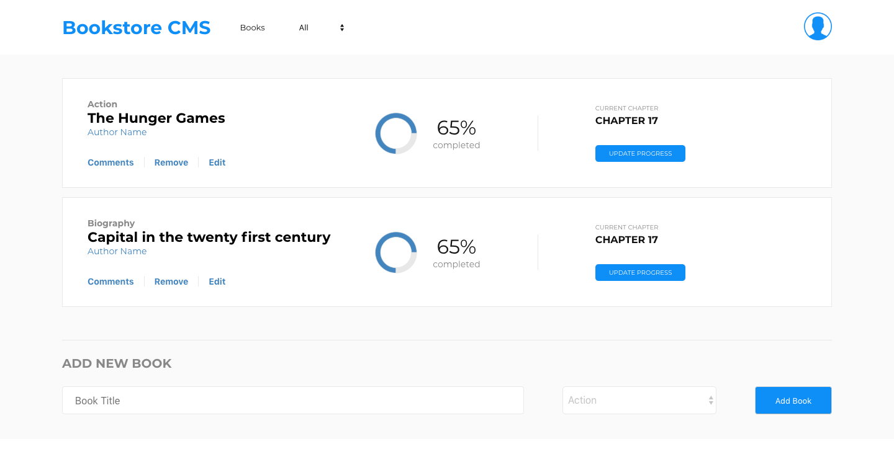

# Bookstore CMS

[Bookstore CMS](https://bookstoreofficial.netlify.com/) Bookstore CMS let's your keep track of all the books that you own. It let's you add/remove/update the books. It is built using React and employs advanced state management technologies such as redux, routers etc. This is a project I built for the Microverse React course.



## Table of content

- [Description](#description)
- [Installation](#installation)
- [Contact](#contact)

## Description

Bookstore CMS let's your keep track of all the books that you own. It let's you add/remove/update the books. It is built using React and employs advanced state management technologies such as redux, routers etc. This is a project I built for the Microverse React course.

### Milestone 1

- Create a barebones app using `create-react-app`
- Delete unwanted files
- Deploy it to heroku with buildpack

### Milestone 2

- Add directory structure
- Implement `App` component
- Implement `BooksList` component
- Implement `Book` component
- Implement `BooksForm` component
- Implement Redux actions and reducers
- Initialize Redux store

### Milestone 3

- Make `BooksForm` stateful to accommodate local input state
- Add `ADD_BOOK` and `REMOVE_BOOK` actions to connect components to redux store

### Milestone 4

- Enhance redux store for `filter`
- Implement `CategoryFilter` component
- Update filter value in redux store

### Milestone 5

- Replicate the UI to look like [this](https://app.zeplin.io/project/5b35a9e13227086040f8eb75/screen/5b695e29bb8c844f118f9378)
- The functionality only works for
  - The filter on the top bar
  - Remove button
  - Add book form
- Added all the items so that it looked the same as the reference link.

## Installation

1. Clone the project to your local directory

```
git clone https://github.com/KaushikShivam/bookstore
```

2. The project uses NPM for managing dependencies. Run npm install to install all the required dependencies

```
npm install
```

3. Run the task runner to run the app

```
npm run start
```

## Contact

You can contact me at:

- [Portfolio](https://www.shivamkaushik.com)
- [Email](mailto:shivamkaushikofficial@gmail.com)
- [Linkedin](https://www.linkedin.com/in/kshivamdev/)
- [Twitter](https://twitter.com/kShivamDev)
- [Medium](https://medium.com/@shivamkaushikofficial)
- [Angellist](https://angel.co/kshivamdev)
